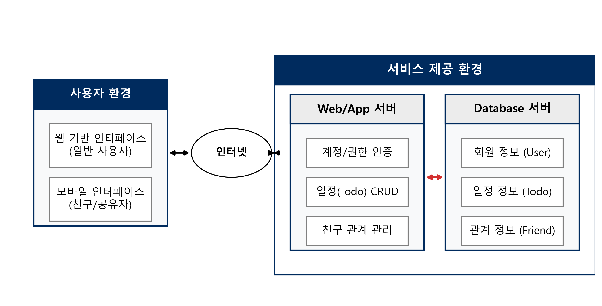

# 데이터베이스 설계 및 구현: Todolist 📝

데이터베이스 실습 과제를 위해 기획된 **상호작용 기반의 소셜 Todolist 서비스**입니다. 
단순한 개인 일정 관리를 넘어, 친구 간 캘린더 공유 및 협업을 지원하는 데이터베이스 설계 및 서비스 구성을 목표로 합니다.

## 🎯 프로젝트 개요
- **주제**: 친구와 함께 일정을 관리하고 조율할 수 있는 소셜 기반 일정 관리 서비스
- **과목**: 데이터베이스 설계 및 구현

## 🛠 주요 기능 (Database View)
1. **사용자 관리**: 후보키(`이메일`, `아이디`, `전화번호`)를 활용한 회원 데이터 식별
2. **일정(Todo) 관리**: 제목, 내용, 달성여부, 날짜, 공개여부 속성을 가진 일정 데이터의 트랜잭션(CRUD) 처리
3. **친구 및 소셜 기능**: 사용자 간의 관계(Relation) 매핑 및 캘린더 상호 접근 권한(Authorization) 관리

## 📂 문서 및 설계자료
- [📖 서비스 정의서](./서비스정의서.md): 서비스 상세 목표, 기능 및 시스템 구성도 아키텍처
- 🖼 **서비스 구성도**:
  
  
